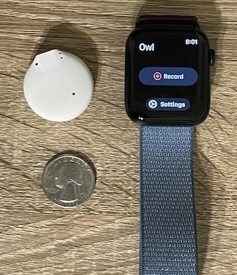
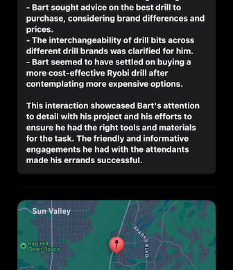
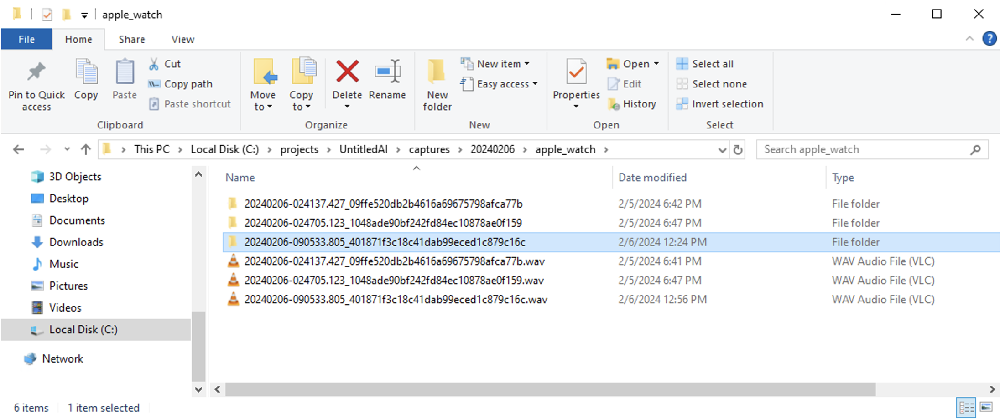
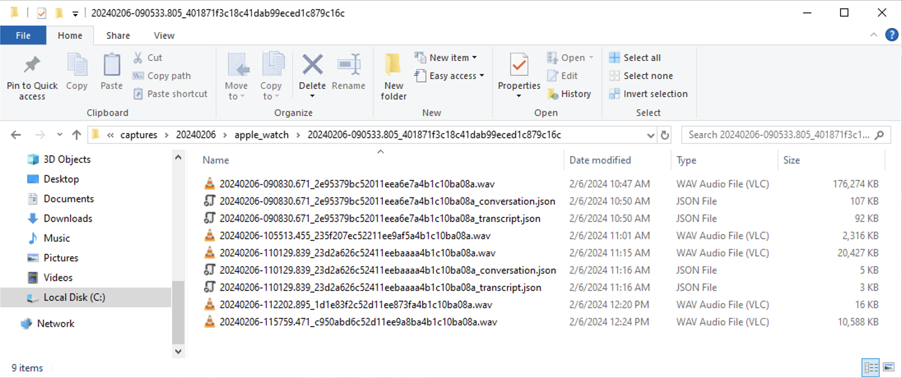

# Owl - Always-on Wearable AI

 

What would you do with an AI that listens to and observes everything that happens in your life? **Owl** aims to explore this idea using always-on wearable devices. The convergence of powerful LLM and VLM models with low-power wearable devices opens up entirely new frontiers for human-computer interaction, including memory augmentation, pro-active life assistance, and distributed knowledge gathering. We believe in exploring this transparently and openly.

### Key Features
* 📱 **Broad Capture Device Support:** Capture your life using custom devices based on ESP platforms, Sony Spresense, or consumer hardware like the Apple Watch. Additional device support is continually added, so anything with a sensor will be able to send data to Owl.
* 🧠 **Flexible Inference Options:** Run completely **locally** or leverage commercial models. Perform inference using any model available on **Ollama**, or use commercial models like GPT-4. Utilize TTS with **Whisper** or choose commercial services like Deepgram.
* 🌐 **Capture from the Web:** Easily capture content from your desktop or any mobile phone.
* 🎙️ **Multimodal Capture:** Engage in continuous capture of location and audio. Support for images and video coming very soon!
* 📶 **Wide Connectivity Options:** Capture with devices supporting BLE, LTE, or WiFi.
* 🚶‍♂️ **Interactive AI on the Go:** Interact with your AI effortlessly through native iOS and web interfaces (Android support coming soon!).
* 🔊 **Speaker Verification:** Your AI learns your voice so it knows when it’s you talking.
* 📡 **Streaming and Offline Modes:** Stream your life to your AI in real-time for proactive assistance, or switch to offline mode in network-constrained environments.
* 💬 **Advanced Conversation Understanding:** Utilize VAD-based conversation endpointing to segment and understand your interactions.

## Table of Contents

- [Overview](#overview)
  - [Project Objectives](#project-objectives)
- [Contact](#contact)
- [Privacy and Security](#privacy-and-security)
- [Setup Guide](#setup-guide)
  - [Server Setup](#server-setup)
  - [iOS and watchOS Application Build Instructions](#ios-and-watchos-application-build-instructions)
  - [Capture Device Setup](#capture-device-setup)
- [Technical Guide](#technical-guide)
  - [A *Tour de Source*](#a-tour-de-source)
  - [Capture Storage](#capture-storage)
- [Contributing](#contributing)

## Overview

### Project Objectives

**Owl** is an experiment in human-computer interaction using wearable devices to observe our lives and extract information and insights from them using AI. Presently, only audio and location are captured, but we plan to incorporate vision and other modalities as well. The objectives of the project are, broadly speaking:

1. Develop an always-on AI system that is *useful*, unlocking new ways to enhance our productivity, our understanding of ourselves and the world around us, and ability to connect with others.
2. Implement specific use cases for always-on AI (e.g., productivity and memory enhancement, knowledge capture and sharing, health, etc.)
3. Explore human-computer interaction questions: user experience, interface design, privacy, security.

There are three major components to this project:

1. Wearable capture devices. These include semi-custom development [boards](docs/development_boards.md) (with some assembly required) as well as off-the-shelf products like Apple Watch. We would like to develop fully custom open source hardware.
2. AI server.
3. Presentation clients. Applications that display information gathered by the system (e.g., transcripts, conversation summaries) and allow interaction with an online assistant. Currently, a mobile app and web app are included.

## Introducing Our Reference Hardware Device: Bee 🐝

  

We are thrilled to unveil "Bee," our pioneering reference hardware device tailored for AI wearable developers and aficionados. Bee distinguishes itself with a remarkable fifty-hour battery life and a sleek, compact form factor, spanning merely 1.2 inches in diameter.

### Key Features of Bee:
- 🔋 **Fifty-Hour Battery Life**: Engineered for longevity, Bee empowers you to unlock new potential by feeding your entire life as context for your personal AI, which is always by your side ready to assist.
- 🤏 **Compact Size**: At just 1.2 inches in diameter, Bee is designed to integrate seamlessly into a myriad of wearable contexts.
- 🌍 **Community Testing Program**: We are offering Bee to select contributors and those keen to delve into its potential and unlocking new use cases around productivity, memory, and agents.

### Join Us
For detailed information about Bee, opportunities for participation in its testing, or to engage with a community of like-minded AI wearable enthusiasts, we invite you to [join our Discord](https://discord.gg/a2UJkDbTBt).

We are eager to see what you build with Bee. 🌟

## Contact

Please [join our Discord](https://discord.gg/a2UJkDbTBt)!

Social media:
- Ethan Sutin ([Twitter](https://twitter.com/ethansutin), [GitHub](https://github.com/etown), [LinkedIn](https://www.linkedin.com/in/ethan-sutin-ba598b6/))
- Bart Trzynadlowski ([Twitter](https://twitter.com/bartronpolygon), [GitHub](https://github.com/trzy), [LinkedIn](https://www.linkedin.com/in/bart-trzynadlowski-9b41938))

## Privacy and Security

- **Respect local privacy and recording laws.** Regardless of what is legally permitted, we ask that users **inform other parties when recording conversations** and comply with their wishes. We ask that users be respectful and fully transparent as they explore use cases for this exciting technology. We welcome feedback and contributions that explore making the user experience more safety and privacy aware.

- Depending on how the server is hosted, **sensitive data may be transmitted and stored in the open**. For example, if running on a home server over HTTP with an exception domain entered into the iOS and Watch Xcode projects, all audio data sent to the server will be unencrypted and conversation transcripts will be readable as plaintext to anyone intercepting packets along the route. Furthermore, HTTP connections allow the user authorization token to be intercepted, allowing access to all conversations stored on the server. Recommended practices to improve security:

  - Servers should be hosted over HTTPS on domains with valid SSL certificates.
  - Use a reverse proxy (such as [ngrok](https://ngrok.com/)) when running on a personal server, which will encrypt traffic using HTTPS.
  - If you absolutely insist on running an unprotected home server, change your authorization token regularly and consider frequently deleting your database and capture directory so as not to leave a large number of conversations exposed.

## Setup Guide

### Server Setup

Platform-specific instructions for installing and running the server:

- [macOS and Linux instructions](docs/macos_and_linux_setup.md).
- [Windows instructions](docs/windows_setup.md).
- [Docker instructions](docs/docker_setup.md).

Once the server is installed, it can be completely customized:

- [Configuring the server](docs/server_configuration.md)

### iOS and watchOS Application Build Instructions

The iOS app is the primary way to view and interact with conversations. The Xcode project also includes a watchOS capture client app that allows Apple Watch to be used as a wearable capture device.

- [iOS and watchOS Application Build Instructions](docs/ios_instructions.md)

### Capture Device Setup

Multiple capture devices are supported:

- [Apple Watch](docs/apple_watch_setup.md)
- [XIAO ESP32S3 Sense Board](docs/xiao_esp32s3_sense_setup.md)
- [Sony Spresense LTE-M Board](docs/sony_spresense_setup.md)

## Technical Guide

### A *Tour de Source*

To help orient newcomers to the code base, we will trace the complete path that data takes through the system, from speech to displayed summary.

#### Streaming Bluetooth Device Example: XIAO ESP32S3 Sense

Bluetooth-based devices, like the XIAO ESP32S3 Sense board in this example, connect to the iOS client application (`clients/ios`) and communicate with it continuously.

1. Audio is continuously picked up by the Sense board's microphone at 16 KHz and encoded to AAC. This reduces packets to a third of their original size, which is important because transmission consumes the most power. Packets are broadcast via BLE as fast as they are recorded in the board firmware's `loop()` function found in `clients/xiao-esp32s3-sense/firmware/src/main.cpp`.

2. Packets enter the iOS app in `peripheral(_:,didUpdateValueFor:,error:)` in `clients/ios/Owl/Services/BLEManager.swift`. The iOS app passes complete frames to the server via a socket. *Frame* here refers to an AAC frame and there is a sequence numbering mechanism used to detect dropped BLE packets. AAC frames are independent, allowing us to drop incomplete frames that would cause downstream transcription models to choke.

3. Frames enter the server socket in `on_audio_data()` in `owl/server/capture_socket.py`. The `CaptureSocketApp` object is created with the FastAPI server in `main.py`. The capture session's UUID is used to look up the appropriate `StreamingCaptureHandler` and the data is forwarded there.

4. In `owl/server/streaming_capture_handler.py`, the audio data is appended to files on disk and then passed along to a transcription service for real-time transcription and conversation endpoint detection. A `Capture` object, which is recorded in the persistent database, is created and represents the capture session and file on disk. Capture files contain all audio recorded during a session. As conversations are detected, they are written out to capture *segment* files with associated `CaptureSegment` objects to represent them. These can be thought of as "children" of the parent capture file. `Conversation` objects are produced to store the conversations themselves (transcript, summaries, processing state, etc.) Whenever a conversation is created by the conversation service, a notification is pushed to the server over the socket connection to the iOS app.

5. The transcription service uses a streaming transcription model (Deepgram at the time of this writing, with a local option planned) that delivers utterances to `handle_utterance()`. This in turn passes the utterance, which includes timestamps, to the endpointing service. When the endpointing service determines a conversation has ended, `on_endpoint()` is invoked. The completed conversation segment file is then transcribed more thoroughly and summarized. A task is created and dispatched to the server's async background processing queue, which is drained continuously in `main.py` (`process_queue()`). The task, still in `streaming_capture_handler.py`, simply calls `process_conversation_from_audio()` on `ConversationService`, an instance of which was created as part of the server app's shared state (`AppState`).

6. `ConversationService` in `owl/services/conversation/conversation_service.py` transcribes the conversation audio using a non-streaming model, creates summaries, and associates a location with the conversation based on location data sent to the server from the iOS app. All this is committed to the database as well as the local capture directory in the form of JSON files for easy inspection. Finally, a notification is sent via `send_notification()` on a `NotificationService` instance (defined in `owl/services/notification/notification_service.py`). This uses the socket connection to push the newly-created conversation to the iOS app.

7. Back in the iOS app: `ConversationsViewModel` in `clients/ios/Owl/ViewModels/ConversationsViewModel.swift` subscribes to conversation messages and updates a published property whenever they arrive. The view model object is instantiated in `ContentView`, the top-level SwiftUI view, and handed to `ConversationsView`.

8. `ConversationsView` observes the view model and updates a list view whenever it changes, thereby displaying conversations to the user.

That sums up the end-to-end process, which begins in a capture device client, transits through the server, and ends at the iOS client.

#### Chunked and Spooled Audio Example: Apple Watch

The server also supports non-real time syncing of capture data in chunks, which uses a different server route than the real-time streaming case. These can be uploaded long after a capture session has finished. Apple Watch has support for both streaming and spooling with opportunistic chunked uploads.

1. In the Watch app's `ContentView` (`clients/ios/Owl Watch App/Views/ContentView.swift`), tapping the record button starts a capture session using the `CaptureManager` singleton object.

2. `CaptureManager` (`clients/ios/Owl Watch App/Services/CaptureManager.swift`) starts recording by setting up an `AVAudioSession` and installing a tap to receive audio samples in `startAudioEngine()`. The tap downsamples to 16 KHz and passes the audio to an `AudioFileWriter` instance, which writes to disk. Even entry level Watch models have 32GB of disk space!

3. `AudioFileWriter` (`clients/ios/Shared/Files/AudioFileWriter.swift`) writes multiple sequential files named with the capture timestamp and UUID plus a sequential chunk number. After some time (e.g., 30 seconds), the current chunk is completed and the next file is created. Files contain raw PCM data and are equivalent to a header-less wave file.

4. Meanwhile, the Watch app runs an asynchronous task (see `clients/ios/Shared/FileUploadTask.swift`), spawned when the app launches, monitoring for files to upload. Files are uploaded sequentially via a POST to the server and deleted when this succeeds. Once all current files are uploaded, a special empty sentinel file is checked to determine whether the capture is actually finished and a processing request is sent to the server. The details of this process are explained in comment blocks in `FileUploadTask.swift`. Because files are stored on disk, they can be transferred while the recording is in progress or even hours or days later. Uploading can be disabled altogether via a setting in the app.

5. On the server, the `/capture/upload_chunk` route receives files. Files with the same `capture_uuid` are simply appended sequentially in the order they arrive. This happens in `owl/server/routes/capture.py`.

6. Each chunk of data is handed off to a background task, `ProcessAudioChunkTask`, processed asynchronously (`process_queue()` in `owl/server/main.py`). This task runs conversation detection incrementally to find conversation beginning and end timestamps. This process differs from the streaming version, although we hope to unify them somehow. A voice activity detector (VAD) is used to look for long stretches of silence to segment conversations, which is a naive and unreliable heuristic. Once conversations are identified, they are extracted into their own files and then sent off for processing using `process_conversation_from_audio()` on `ConversationService`. From this point onwards, the flow is the same as for the streaming case described above. It is important to note that conversations are detected as soon as possible by inspecting chunks.

7. Lastly, if the capture session ends and the `/process_capture` route is used, a final `ProcessAudioChunkTask` is submitted to finalize any remaining conversation that may have been ongoing in the final chunk.

Chunked uploads enter the server differently than streaming audio, use a different conversation endpointing method, but then follow the same path back to the iOS app.

### Capture Storage

Captures are stored in the directory specified by the `capture_dir` key in the YAML configuration file. They are organized by date and capture
device to make manual inspection easy. When conversations are detected within a capture, they are extracted into a subdirectory named after the capture file. The subdirectory will contain conversation audio files as well as transcripts and summaries in JSON form. Conversation detection may sometimes be incorrect; conversations that are too short or contain no dialog at all are not summarized and the corresponding JSON files will be absent.

 
<i>Apple Watch captures recorded on February 17, 2024, with subdirectories for conversations.</i>

 
<i>Conversations extracted from a particular capture.</i>

## Contributing

We welcome discussion and contributions. Please [connect with us](#contact). To contribute, we recommend:

  - [Opening an issue](https://github.com/OwlAIProject/Owl/issues) and describing what you are working on so that everyone is aware and we have a chance to discuss.
  - Forking our repo and making a pull request when ready.
