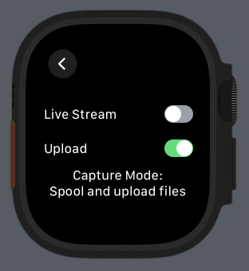
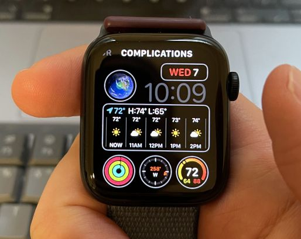
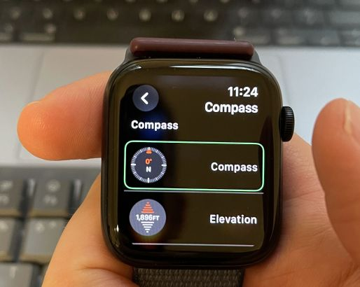
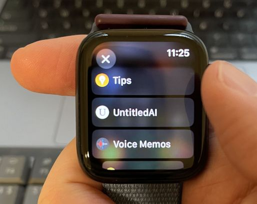

# Always-on Perceptive AI

## Table of Contents

- [Privacy and Security](#privacy-and-security)
- [Setup Guide](#setup-guide)
  - [Server Setup](#server-setup)
  - [iOS Application Setup](#ios-application-setup)
  - [Capture Client Setup](#capture-client-setup)
- [User Guides for Capture Devices](#user-guides-for-capture-devices)
  - [Apple Watch](#apple-watch)
  - [Xiao ESP32S3 Sense Board](#xiao-esp32s3-sense-board)
- [Source Code Tour](#source-code-tour)
- [Capture Storage](#capture-storage)

## Privacy and Security

- **Respect local privacy and recording laws.** Regardless of what is legally permitted, we ask that users **inform other parties when recording conversations** and comply with their wishes. We ask that users be respectful and fully transparent as they explore use cases for this exciting technology. We welcome feedback and contributions that explore making the user experience more safety and privacy aware.

- Depending on how the server is hosted, **sensitive data may be transmitted and stored in the open**. For example, if running on a home server over HTTP with an exception domain entered into the iOS and Watch Xcode projects, all audio data sent to the server will be unencrypted and conversation transcripts will be readable as plaintext to anyone intercepting packets along the route. Furthermore, HTTP connections allow the user authorization token to be intercepted, allowing access to all conversations stored on the server. Recommended practices to improve security:

  - Servers should be hosted over HTTPS on domains with valid SSL certificates.
  - Use a reverse proxy (such as [ngrok](https://ngrok.com/)) when running on a personal server, which will encrypt traffic using HTTPS.
  - If you absolutely insist on running an unprotected home server, change your authorization token regularly and consider frequently deleting your database and capture directory so as not to leave a large number of conversations exposed.

## Setup Guide

### Server Setup

Platform-specific instructions for installing and running the server:

- [macOS and Linux instructions](docs/macos_and_linux_setup.md).
- [Windows instructions](docs/windows_setup.md).

Once the server is installed, some configuration is necessary before it can be run:

- [Configuring the server](docs/server_configuration.md)

### iOS Application Setup

TODO: write me

### Capture Client Setup

Multiple capture clients are supported:

- Apple Watch
- Xiao ESP32S3 Sense Board

## User Guides for Capture Devices

### Apple Watch

#### Basic Operation

The app's main screen allows recording to be toggled. Recording continues in the background until stopped explicitly or the app is force quit.

  
<i>Recording is initiated and stopped on the main screen. Settings control transfer modes.</i>

The settings screen allows the capture mode to be configured. There are three permutations:

- **Spool and upload files**: The recording is spooled to disk in chunks, which are then uploaded sequentially as soon as possible. If uploading fails (e.g., the server is down or inaccessible), the app will retry forever and keep accumulating recordings on disk. Files persist on disk even when the app is killed and will resume uploading the next time it runs.
- **Spool to disk**: The same as above but with uploading disabled. Uploads must be re-enabled for the audio to make it to the server.
- **Live stream**: Audio samples are streamed to the server immediately via a TCP connection. There is no spooling to disk and any packets that are dropped are lost forever. However, the packets can be immediately processed by the server, permitting real-time assistant applications to be developed.

**NOTE:** Uploading only occurs when the app is recording or in the foreground with the Watch screen on. Once the microphone is turned off and the app is no longer on-screen, file transfers halt. Background sync (perhaps via the Watch Connectivity framework) is a planned feature and contributions are welcome.

#### Watch Face Complication

The app features a complication that can be added to the watch face for quicker access. Tap and hold your watch face to enable editing mode,
select a complication, and choose the app using the digital crown. The steps are shown below.

 
<i><b>Step 1:</b> Tap and hold the watch face to customize it.</i>

 
<i><b>Step 2:</b> Tap <b>Edit</b> and swipe right to the <b>Complications</b> view.</i>

 
<i><b>Step 3:</b> Select the complication you want to replace to bring up a menu of options. Tap the arrow in the upper left of this screen for more options and to locate the app.</i>

 
<i><b>Step 4:</b> Using the crown, scroll to find the app.</i>

 
<i><b>Step 5:</b> Once confirmed, the complication will be visible on the watch face.</i>

### Xiao ESP32S3 Sense Board

TODO: battery warning and mention potential dangers of lacking a battery protection circuit, battery discharge

## Source Code Tour

To help orient newcomers to the code base, we will trace the complete path that data takes through the system, from speech to displayed summary.

### Streaming Bluetooth Device Example: Xiao ESP32S3 Sense

Bluetooth-based devices, like the Xiao ESP32S3 Sense board in this example, connect to the iOS client application (`clients/ios`) and communicate with it continuously.

1. Audio is continuously picked up by the Sense board's microphone at 16 KHz and encoded to AAC. This reduces packets to a third of their original size, which is important because transmission consumes the most power. Packets are broadcast via BLE as fast as they are recorded in the board firmware's `loop()` function found in `clients/xiao-esp32s3-sense/firmware/src/main.cpp`.

2. Packets enter the iOS app in `peripheral(_:,didUpdateValueFor:,error:)` in `clients/ios/UntitledAI/Services/BLEManager.swift`. The iOS app passes complete frames to the server via a socket. *Frame* here refers to an AAC frame and there is a sequence numbering mechanism used to detect dropped BLE packets. AAC frames are independent, allowing us to drop incomplete frames that would cause downstream transcription models to choke.

3. Frames enter the server socket in `on_audio_data()` in `untitledai/server/capture_socket.py`. The `CaptureSocketApp` object is created with the FastAPI server in `main.py`. The capture session's UUID is used to look up the appropriate `StreamingCaptureHandler` and the data is forwarded there.

4. In `untitledai/server/streaming_capture_handler.py`, the audio data is appended to files on disk and then passed along to a transcription service for real-time transcription and conversation endpoint detection. A `Capture` object, which is recorded in the persistent database, is created and represents the capture session and file on disk. Capture files contain all audio recorded during a session. As conversations are detected, they are written out to capture *segment* files with associated `CaptureSegment` objects to represent them. These can be thought of as "children" of the parent capture file. `Conversation` objects are produced to store the conversations themselves (transcript, summaries, processing state, etc.) Whenever a conversation is created by the conversation service, a notification is pushed to the server over the socket connection to the iOS app.

5. The transcription service uses a streaming transcription model (Deepgram at the time of this writing, with a local option planned) that delivers utterances to `handle_utterance()`. This in turn passes the utterance, which includes timestamps, to the endpointing service. When the endpointing service determines a conversation has ended, `on_endpoint()` is invoked. The completed conversation segment file is then transcribed more thoroughly and summarized. A task is created and dispatched to the server's async background processing queue, which is drained continuously in `main.py` (`process_queue()`). The task, still in `streaming_capture_handler.py`, simply calls `process_conversation_from_audio()` on `ConversationService`, an instance of which was created as part of the server app's shared state (`AppState`).

6. `ConversationService` in `untitledai/services/conversation/conversation_service.py` transcribes the conversation audio using a non-streaming model, creates summaries, and associates a location with the conversation based on location data sent to the server from the iOS app. All this is committed to the database as well as the local capture directory in the form of JSON files for easy inspection. Finally, a notification is sent via `send_notification()` on a `NotificationService` instance (defined in `untitled/services/notification/notification_service.py`). This uses the socket connection to push the newly-created conversation to the iOS app.

7. Back in the iOS app: `ConversationsViewModel` in `clients/ios/UntitledAI/ViewModels/ConversationsViewModel.swift` subscribes to conversation messages and updates a published property whenever they arrive. The view model object is instantiated in `ContentView`, the top-level SwiftUI view, and handed to `ConversationsView`.

8. `ConversationsView` observes the view model and updates a list view whenever it changes, thereby displaying conversations to the user.

That sums up the end-to-end process, which begins in a capture device client, transits through the server, and ends at the iOS client.

### Chunked and Spooled Audio Example: Apple Watch

The server also supports non-real time syncing of capture data in chunks, which uses a different server route than the real-time streaming case. These can be uploaded long after a capture session has finished. Apple Watch has support for both streaming and spooling with opportunistic chunked uploads.

1. In the Watch app's `ContentView` (`clients/ios/UntitledAI Watch App/Views/ContentView.swift`), tapping the record button starts a capture session using the `CaptureManager` singleton object.

2. `CaptureManager` (`clients/ios/UntitledAI Watch App/Services/CaptureManager.swift`) starts recording by setting up an `AVAudioSession` and installing a tap to receive audio samples in `startAudioEngine()`. The tap downsamples to 16 KHz and passes the audio to an `AudioFileWriter` instance, which writes to disk. Even entry level Watch models have 32GB of disk space!

3. `AudioFileWriter` (`clients/ios/Shared/Files/AudioFileWriter.swift`) writes multiple sequential files named with the capture timestamp and UUID plus a sequential chunk number. After some time (e.g., 30 seconds), the current chunk is completed and the next file is created. Files contain raw PCM data and are equivalent to a header-less wave file.

4. Meanwhile, the Watch app runs an asynchronous task (see `clients/ios/Shared/FileUploadTask.swift`), spawned when the app launches, monitoring for files to upload. Files are uploaded sequentially via a POST to the server and deleted when this succeeds. Once all current files are uploaded, a special empty sentinel file is checked to determine whether the capture is actually finished and a processing request is sent to the server. The details of this process are explained in comment blocks in `FileUploadTask.swift`. Because files are stored on disk, they can be transferred while the recording is in progress or even hours or days later. Uploading can be disabled altogether via a setting in the app.

5. On the server, the `/capture/upload_chunk` route receives files. Files with the same `capture_uuid` are simply appended sequentially in the order they arrive. This happens in `untitledai/server/routes/capture.py`.

6. Each chunk of data is handed off to a background task, `ProcessAudioChunkTask`, processed asynchronously (`process_queue()` in `untitledai/server/main.py`). This task runs conversation detection incrementally to find conversation beginning and end timestamps. This process differs from the streaming version, although we hope to unify them somehow. A voice activity detector (VAD) is used to look for long stretches of silence to segment conversations, which is a naive and unreliable heuristic. Once conversations are identified, they are extracted into their own files and then sent off for processing using `process_conversation_from_audio()` on `ConversationService`. From this point onwards, the flow is the same as for the streaming case described above. It is important to note that conversations are detected as soon as possible by inspecting chunks.

7. Lastly, if the capture session ends and the `/process_capture` route is used, a final `ProcessAudioChunkTask` is submitted to finalize any remaining conversation that may have been ongoing in the final chunk.

Chunked uploads enter the server differently than streaming audio, use a different conversation endpointing method, but then follow the same path back to the iOS app.

## Capture Storage

Captures are stored in the directory specified by the `capture_dir` key in the YAML configuration file. They are organized by date and capture
device to make manual inspection easy. When conversations are detected within a capture, they are extracted into a subdirectory named after the capture file. The subdirectory will contain conversation audio files as well as transcripts and summaries in JSON form. Conversation detection may sometimes be incorrect; conversations that are too short or contain no dialog at all are not summarized and the corresponding JSON files will be absent.

 
<i>Apple Watch captures recorded on February 6, 2024, with subdirectories for conversations.</i>

 
<i>Conversations extracted from a particular capture.</i>

