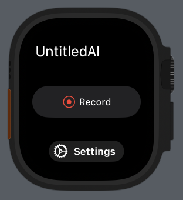
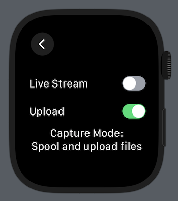
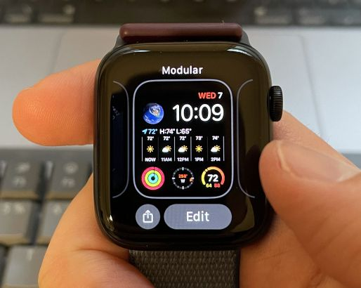
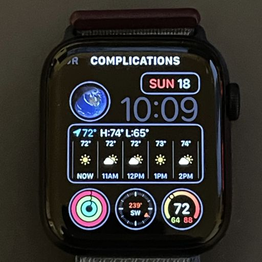
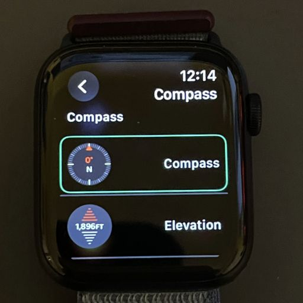
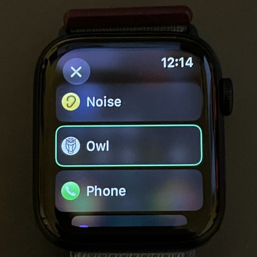
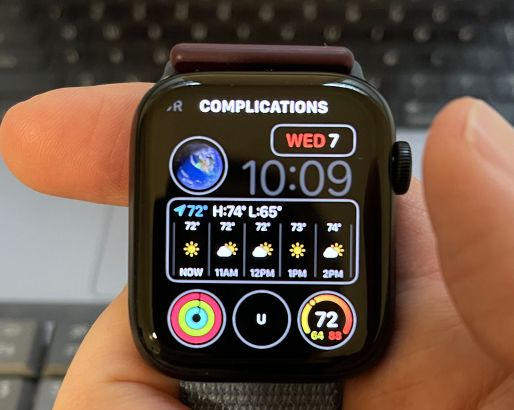

# Owl - Always-on Wearable AI

[<< Home](../README.md)

## Apple Watch Setup and User Guide

### Building and Deploying the App

- Follow the [instructions for building and deploying the Apple Watch app from the Xcode project](ios_instructions.md).

### Basic Operation

The app's main screen allows recording to be toggled. Recording continues in the background until stopped explicitly or the app is force quit.

  
<i>Recording is initiated and stopped on the main screen. Settings control transfer modes.</i>

The settings screen allows the capture mode to be configured. There are three permutations:

- **Spool and upload files**: The recording is spooled to disk in chunks, which are then uploaded sequentially as soon as possible. If uploading fails (e.g., the server is down or inaccessible), the app will retry forever and keep accumulating recordings on disk. Files persist on disk even when the app is killed and will resume uploading the next time it runs.
- **Spool to disk**: The same as above but with uploading disabled. Uploads must be re-enabled for the audio to make it to the server.
- **Live stream**: Audio samples are streamed to the server immediately via a TCP connection. There is no spooling to disk and any packets that are dropped are lost forever. However, the packets can be immediately processed by the server, permitting real-time assistant applications to be developed.

**NOTE:** Uploading only occurs when the app is recording or in the foreground with the Watch screen on. Once the microphone is turned off and the app is no longer on-screen, file transfers halt. Background sync (perhaps via the Watch Connectivity framework) is a planned feature and contributions are welcome.

#### Watch Face Complication

The app features a complication that can be added to the watch face for quicker access. Tap and hold your watch face to enable editing mode,
select a complication, and choose the app using the digital crown. The steps are shown below.

 
<i><b>Step 1:</b> Tap and hold the watch face to customize it.</i>

 
<i><b>Step 2:</b> Tap <b>Edit</b> and swipe right to the <b>Complications</b> view.</i>

 
<i><b>Step 3:</b> Select the complication you want to replace to bring up a menu of options. Tap the arrow in the upper left of this screen for more options and to locate the app.</i>

 
<i><b>Step 4:</b> Using the crown, scroll to find the app.</i>

 
<i><b>Step 5:</b> Once confirmed, the complication will be visible on the watch face.</i>

[<< Home](../README.md)
