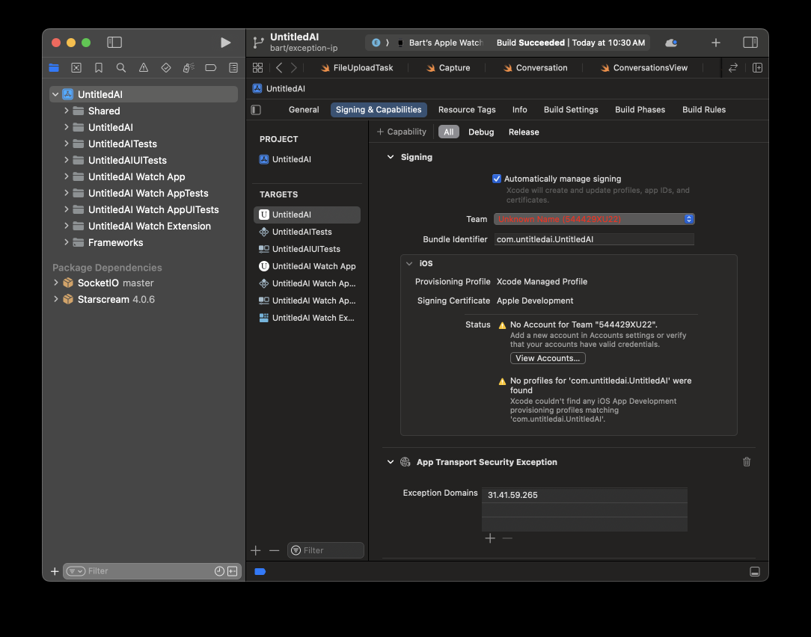
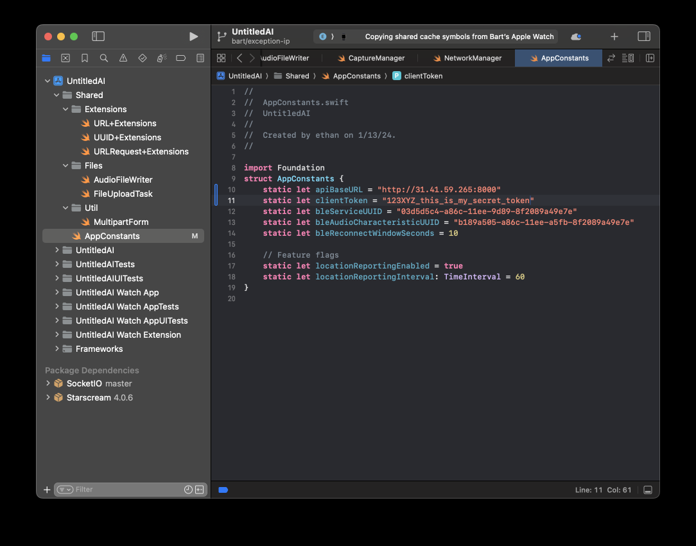

# Always-on Perceptive AI

[<< Home](../README.md)

## iOS and watchOS Application Build Instructions

Step-by-step instructions are provided here for building and installing the iOS and watchOS apps. If you are not planning to deploy the Apple Watch app, steps involving the watchOS target can be ignored.

### 1. Install Xcode

- [Download and install Xcode](https://developer.apple.com/xcode/).
- Create the required Apple Developer Program account. This is free.

### 2. Enable Developer Mode on iPhone and Watch

- [Enable developer mode on your devices](https://developer.apple.com/documentation/xcode/enabling-developer-mode-on-a-device). This is required in order to deploy builds from Xcode.

### 3. Open Xcode Project and Configure Development Team

Upon first cloning the repository, the development team values in the Xcode project will be invalid and must be manually set.

- Open the Xcode project, located at `clients/ios/UntitledAI.xcodeproj`.

- To find the targets, select the project in the left-most file browser pane, then click on each target in the target list. The *Team* field is under *Signing & Capabilities*.

 
<i>Location of the Team field in Xcode.</i>

- Change the development team to your personal team. Do this for each target. **Tip:** You can attempt to build the project immediately and then use the error message pane to locate all the places that *Team* must be changed.

 
<i>Choose a valid development team, such as your personal team.</i>

### 4. Configure Exception Domains

We **strongly** recommend running the server over HTTPS in order to ensure that conversation transcripts and audio cannot be intercepted. Remember that this affects not only you but other parties captured in your conversations. If running a server at home not associated with an HTTPS-enabled domain, use a reverse proxy like [ngrok](https://ngrok.com). If this is simply not an option or for conducting quick testing, and being mindful of the security risks involved, you must configure the iOS project to allow HTTP access to your server. By default, iOS prohibits unencrypted HTTP traffic.

- Enter the host IP address of your server in the *App Transport Security Exception* section of *Signing & Capabilities* for the main iOS and watchOS targets. This setting is found in the same dialog as the developer team setting. Add a new exception domain to the list or change the sample IP address (31.41.59.265, a placeholder).

 
<i>Exception domains are specified in the same place as development team.</i>

### 5. Configure App Constants

The server address and client token (created during [server configuration](server_configuration.md)) must be entered into their respective fields in the `AppConstants` structure, found in `Shared/AppConstants.swift`.

 
<i>Server address and client token must be set in `AppConstants.swift`.</i>

### 6. Build and Deploy

TODO: write me

### 7. Reverse Proxy for HTTPS Support

Using a reverse proxy to securely access the server is simple. Any reverse proxy can be used but instructions for [ngrok](https://ngrok.com) will be shown here.

- Install and configure ngrok by [following this guide](https://ngrok.com/docs/getting-started/). Ensure it is accessible from your path.

- Assuming the server is running on its default port of 8000, start the reverse proxy by running: `ngrok http http://localhost:8000`

- Note the public address and enter it into `AppConstants.swift`. Do not specify port 8000 (the proxy URL will automatically redirect to it). Because this is an HTTPS-capable connection, there is no need to modify the exception domains list.

- Build and deploy the iOS and watchOS apps.

[<< Home](../README.md)
