# Owl - Always-on Wearable AI

[<< Home](../README.md)

## XIAO ESP32S3 Sense Board Setup and User Guide

Seeed Studio's [XIAO ESP32S3 Sense board](https://www.seeedstudio.com/XIAO-ESP32S3-Sense-p-5639.html) is an extremely compact and reasonably power-efficient development board that features BLE and WiFi connectivity, a microphone, a camera, and dual Xtensa LX7 (RISC-V-based) cores running at 240 MHz. It can be powered via its USB-C port or by soldering on a battery and placed in a small case.

<p align="center">
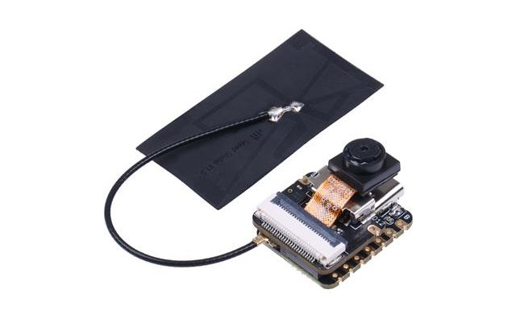<br>
<i>XIAO ESP32S3 Sense board with antenna.</i>
</p>

This board is simple to get up and running without any modifications but for a truly wearable solution, some additional work is required. This guide will cover procurement, basic set up, and instructions for building a very crude prototype wearable.


### Table of Contents

- [Procurement](#procurement)
- [Board Setup](#board-setup)
- [Software Installation](#software-installation)
- [Connecting to the iOS App](#connecting-to-the-ios-app)
- [Connecting a Battery](#connecting-a-battery)
- [Wearable Case](#wearable-case)
- [Resources](#resources)


### Procurement

The XIAO ESP32S3 Sense board can be obtained from numerous vendors including Seeed Studio:

- [Seeed Studio](https://www.seeedstudio.com/XIAO-ESP32S3-Sense-p-5639.html)
- [DigiKey](https://www.digikey.com/en/products/detail/seeed-technology-co.,-ltd/113991115/18724504)
- [Mouser](https://www.mouser.com/ProductDetail/Seeed-Studio/113991115?qs=3Rah4i%252BhyCEkFZeikDKazg%3D%3D)

To build a wearable version, purchase a 3.7V lithium polymer battery. Some suggested products are listed below:

- [EEMB 1200 mAh battery](https://www.amazon.com/EEMB-Battery-1200mah-Rechargeable-Connector/dp/B09G2S88Q3) - for 8 or more hours of continuous operation.
- [EEMB 540 mAh battery](https://www.amazon.com/EEMB-Battery-Rechargeable-Lithium-Connector/dp/B09WR78RY3) - for 4 hours of continuous operation. Recommended for its compact size.

<p align="center">
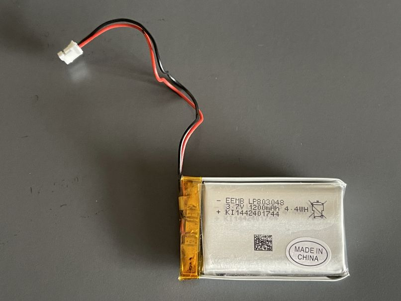<br>
<i>A 1200 mAh 3.7V lithium polymer battery.</i>
</p>

The batteries listed above use male JST-PH 2.0 connectors. It is *highly* recommended that additional connector cables be purchased to solder onto the XIAO board rather than attempting to solder the battery directly. This allows the battery to be easily detached and swapped.

- [JPT-PH 2.0 male and female connector cables](https://www.amazon.com/Upgraded-Connector-Battery-Inductrix-Eachine/dp/B07NWD5NTN)


### Board Setup

Follow Seeed Studio's [guide for setting up the board](https://wiki.seeedstudio.com/xiao_esp32s3_getting_started/). Ensure that:

- The antenna is attached. Refer to Seeed Studio's instructions, included below. It is normal for this process to induce high blood pressure, feelings of depression and hopelessness, and violent mood swings. Just keep at it patiently.

<p align="center">
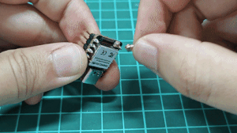<br>
<i>They make antenna installation look so easy!</i>
</p>

```
On the bottom left of the front of XIAO ESP32S3, there is a separate "WiFi/BT Antenna
Connector". In order to get better WiFi/Bluetooth signal, you need to take out the antenna
inside the package and install it on the connector.

There is a little trick to the installation of the antenna, if you press down hard on it
directly, you will find it very difficult to press and your fingers will hurt! The correct way
to install the antenna is to put one side of the antenna connector into the connector block
first, then press down a little on the other side, and the antenna will be installed.

Remove the antenna is also the case, do not use brute force to pull the antenna directly, one
side of the force to lift, the antenna is easy to take off.
```

- The Sense daughterboard, which contains the camera and microphone, is mounted onto the main board. Align the connectors and press gently and evenly until they snap into place.

<p align="center">
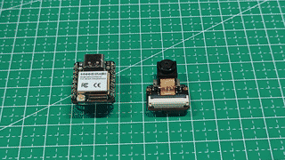<br>
<i>Mount the Sense daughterboard onto the main board.</i>
</p>


### Software Installation

The board firmware at `clients/xiao-esp32s3-sense/firmware` uses the Arduino SDK but with the [PlatformIO](https://platformio.org/) Visual Studio Code extension rather than the Arduino IDE. The build process is the same on Windows and macOS, and should work on Linux, too. To build and flash the firmware for the first time, follow these instructions:

- [Install Visual Studio Code](https://code.visualstudio.com/download) if not already available.

- Install the PlatformIO extension. The extensions marketplace can be accessed by clicking the button in the left vertical tool bar that consists of a series of squares. Search `platformio` and install the extension.

<p align="center">
<br>
<i>Location of the extensions button in Visual Studio Code.</i>
</p>

<p align="center">
<br>
<i>Search for and install PlatformIO.</i>
</p>

- Open the project. From Visual Studio Code, select *File* and *Open Folder...*. Choose `clients/xiao-esp32s3-sense/firmware`, where `platformio.ini` is. It may take a moment for PlatformIO to initialize the project.

- Build the firmware by clicking the build button, located in the bottom toolbar.

<p align="center">
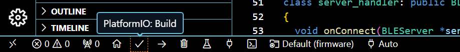<br>
<i>Location of the PlatformIO build button.</i>
</p>

- A terminal window will appear showing the build progress. Ensure that `firmware.elf` is produced successfully.

<p align="center">
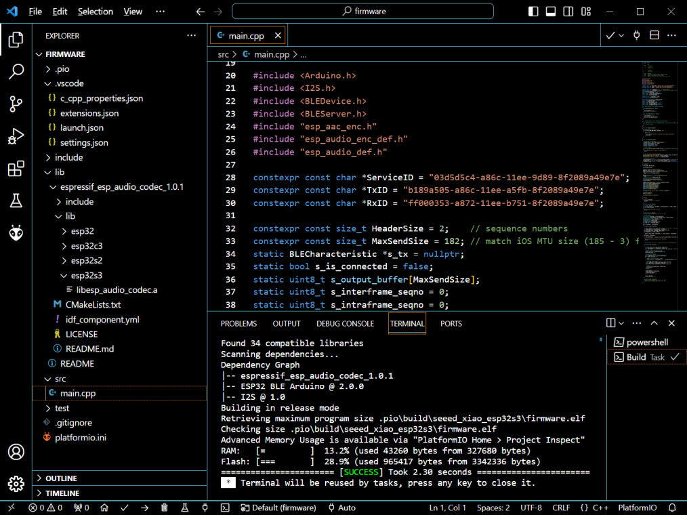<br>
<i>Output of a successful build.</i>
</p>

- Connect the board to your PC using a USB-C cable. Upload the firmware image by clicking the upload button.

<p align="center">
<br>
<i>Location of the PlatformIO upload button.</i>
</p>

- Ensure that the upload was successful. If the board could not be found, try clicking on the serial port selection button to confirm that there is a usable COM port.

<p align="center">
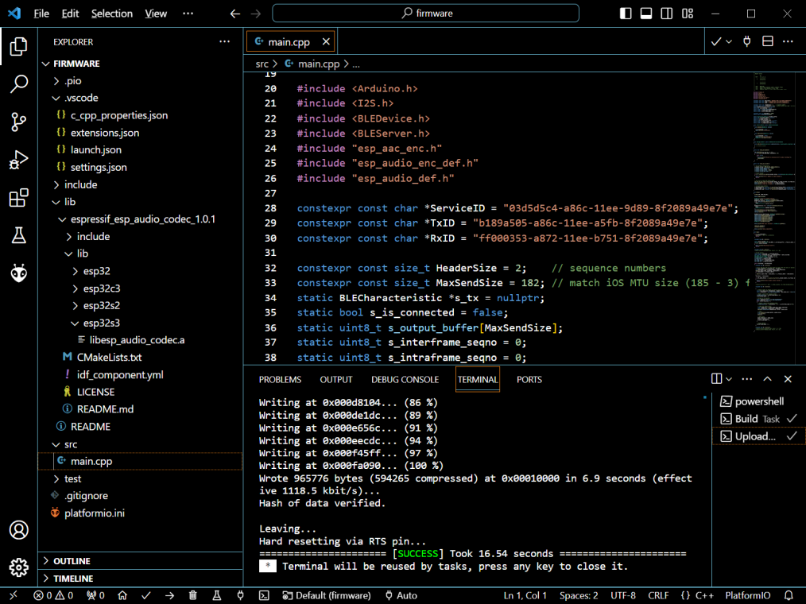<br>
<i>Output of a successful upload.</i>
</p>

<p align="center">
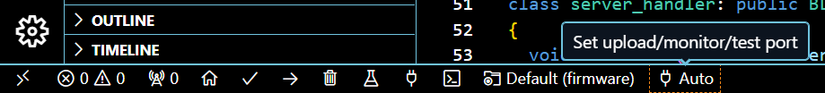<br>
<i>Location of the PlatformIO serial port button. Use this to check whether the board is connected to the computer and manually select the appropriate port if necessary.</i>
</p>

- Now the board will always run the loaded firmware until it is reprogrammed.


### Connecting to the iOS App

The firmware makes the board act as a Bluetooth peripheral that constantly broadcasts audio packets using a specific Bluetooth service ID. It must connect to an Internet-connected device in order to forward audio packets to the server. The iOS app will automatically do this.

To test with iOS:

- [Build and deploy the iOS app](ios_instructions.md).
- Ensure the server is running and that the iOS app is able to reach it.
- Power on the XIAO ESP32S3 Sense board (e.g., connect it to your PC or outlet via USB-C).
- Open the iOS app. It should indicate that the board is connected. Begin speaking and an in-progress conversation will appear.

<p align="center">
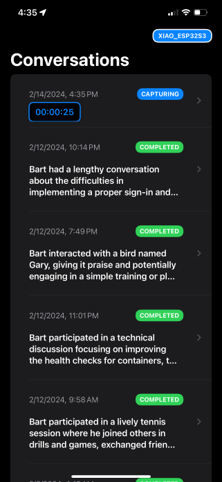<br>
<i>iOS app indicating the XIAO ESP32S3 Sense board is connected and that a conversation is being captured.</i>
</p>

- Remove power from the board or simply stop speaking for several minutes (e.g., 5 minutes, depending on the server's conversation detection parameters). A completed conversation will appear.


<p align="center">
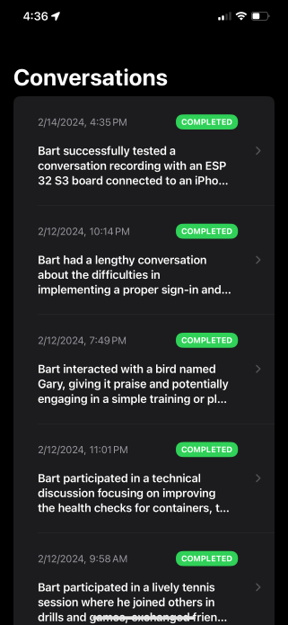 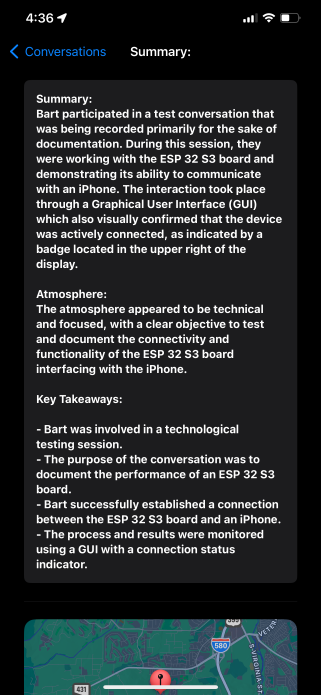<br>
<i>The completed test conversation.</i>
</p>


### Connecting a Battery

The first step in turning the XIAO board into a wearable is connecting it to a battery. The bottom side of the main board contains two pads labeled BAT+ and BAT- for the positive and negative terminals, respectively.

<p align="center">
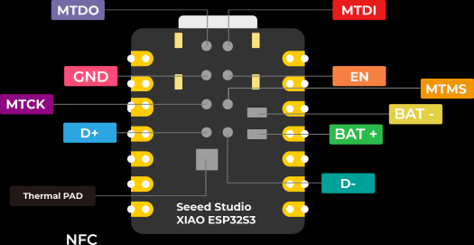<br>
<i>Schematic illustration of pads on the bottom of the main board.</i>
</p>

Rather than soldering a battery directly, which would prevent the device from ever being powered down, it is recommended that a [JST-PH 2.0 female connector](https://www.amazon.com/Upgraded-Connector-Battery-Inductrix-Eachine/dp/B07NWD5NTN) be used. Solder the connector in the orientation shown below, so that the wires extend over the board. This allows the wires to be secured with hot glue or electrical tape (not pictured) to relieve tension on the solder joints, which may cause them to break and disconnect.

<p align="center">
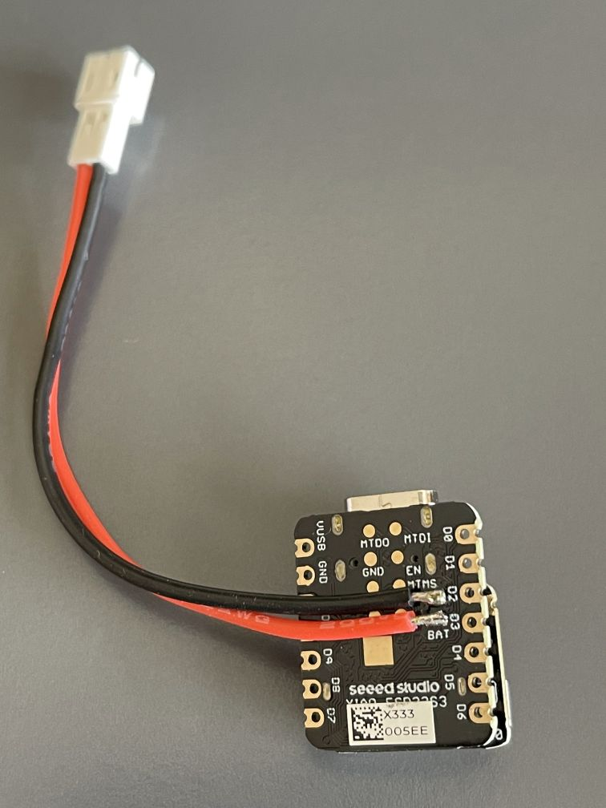<br>
<i>JST-PH 2.0 female connector soldered to the XIAO ESP32S3 Sense main board.</i>
</p>

**WARNING:** The suggested EEMB lithium polymer battery packs frequently have their male connector polarity oriented opposite from the female connector. Check to ensure that the positive wire (usually red) will actually make contact with the female-end wire connected to BAT+. It may be necessary to carefully remove the wires from the male connector (using an approach [shown in this video](https://www.youtube.com/watch?v=kRvDgiX4Sk4) or [this video](https://www.youtube.com/watch?v=za-azgbZor8)) and reinsert them. It is also possible to tie together a pair of male and female connectors with wires crossed to create an adapter, although this adds a lot of wiring.

### Wearable Case

Currently, no custom case for this device has been developed. We welcome contributions -- please [get in touch](../README.md#contact) if you have built one!

A [Raspberry Pi Model 3 A+ case](https://www.adafruit.com/product/4096) was successfully used to house the board with a large (1200-1800 mAh) battery, shown in the photo below. The toggle switch was found in a bin of unlabeled parts but is probably similar to [this model](https://www.mouser.com/ProductDetail/TE-Connectivity-Alcoswitch/A201SYAQ04?qs=qzQkFgQjdxWhGAhAKWdSng%3D%3D) or [this part](https://www.mouser.com/ProductDetail/Bulgin/C3960BBAAA?qs=T3oQrply3y%252BC5iNKAoP%2FOA%3D%3D). It was mounted through the circular audio connector opening and affixed using a nut and washer included on the switch. The switch was wired to break the connection with the battery's positive terminal using a pair of JST-PH 2.0 connector cables.

<p align="center">
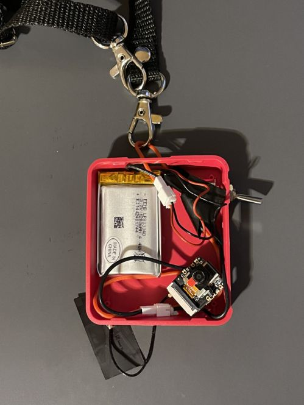 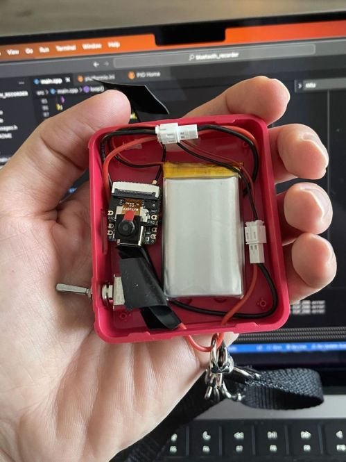<br>
<i>A friend of mine is an industrial designer. It is difficult to get his attention when examining a magnificent product. I showed him this device and asked him what it would take to build it today. I will never forget his answer: "We can't, we don't know how to do it."</i>
</p>

### Resources

XIAO ESP32S3 Sense board resources:

- [Getting Started with Seeed Studio XIAO ESP32S3 (Sense)](https://wiki.seeedstudio.com/xiao_esp32s3_getting_started/)

Recommended tools for electronics beginners:

- [Neoteck digital multimeter](https://www.amazon.com/Neoteck-Multimeter-Multimeters-Resistance-Transistor/dp/B01NAVAT9S): A multimeter for measuring voltage and checking continuity is absolutely essential.
- [Weller Digital Soldering Station WE1010NA](https://www.amazon.com/Weller-Digital-Soldering-Station-WE1010NA/dp/B077JDGY1J): Soldering is much easier to learn with a reliable soldering iron and generations of engineers have used Weller. Do not skimp here.
- [Hakko Tip Cleaner 599B](https://www.amazon.com/Soldering-Cleaner-599B-Water-free-Hakko/dp/B000AQQFMG): For cleaning the tip of your soldering iron. This semi-enclosed design is convenient.
- [Kester 63/37 (Lead/Tin) solder wire](https://www.amazon.com/Kester-Rosin-Core-Solder-Dispense-Pak/dp/B00AVLM4SO): Leaded solder is easier to work with due to its lower melting point and higher wettability, and produces better solder joints. Avoid lead-free solder, especially if you are a beginner.
- [NTE Electronics SW02-10 solder wick](https://www.amazon.com/NTE-Electronics-SW02-10-No-Clean-Blue-098/dp/B0195UVWJ8): Solder wick is used for removing solder. When placed between a hot iron tip and an errant bit of solder, the braided copper transfers heat to the solder, melting it, and then wicking it away (trapping it within the braids).

[<< Home](../README.md)
